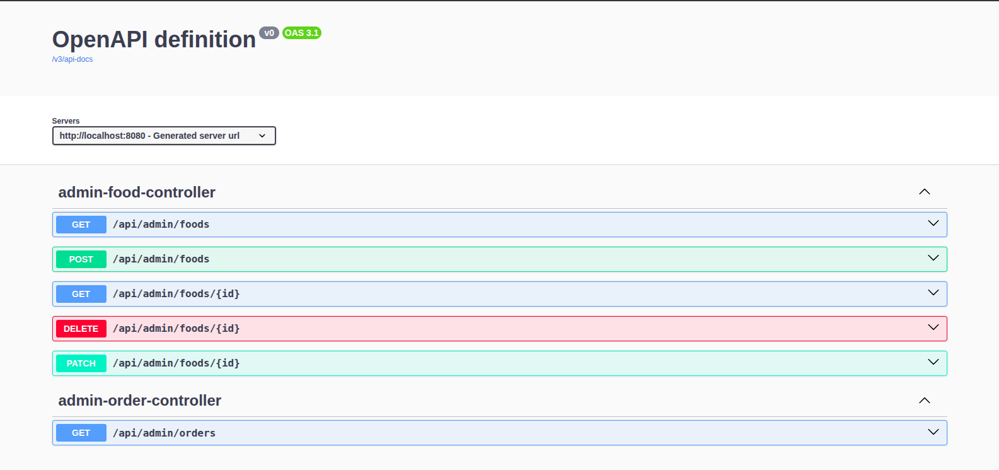

# ربات رزرو غذا (Food Reserve Bot)

این پروژه یک **سیستم رزرو غذا** مبتنی بر **Spring Boot** و **Telegram Bot** است که شامل:

* ربات تلگرام برای کاربران
* API ادمین برای مدیریت غذا و سفارش‌ها

می‌باشد.

---

## امکانات

### کاربران (از طریق تلگرام)

* مشاهده منوی غذاهای موجود
* ثبت سفارش با انتخاب غذا
* دریافت پیام تأیید سفارش

### ادمین (REST API)

* ایجاد، ویرایش و حذف غذا
* مشاهده لیست سفارش‌ها
* فیلتر سفارش‌ها بر اساس کاربر و بازه زمانی

---

## تکنولوژی‌ها

* Java 21+
* Spring Boot
* Spring Data JPA
* Spring Security (Basic Auth برای ادمین)
* MySQL
* Telegram Bot API (pengrad)

---

## تنظیمات پروژه

### متغیرهای محیطی (Environment Variables)

برای اجرای پروژه، مقادیر زیر باید تنظیم شوند:

```
DB_URL=jdbc:mysql://localhost:3306/food_reserve_bot
DB_USERNAME=db_username
DB_PASSWORD=db_password

TELEGRAM_BOT_TOKEN=your_bot_token_here
TELEGRAM_BOT_USERNAME=your_bot_username
ADMIN_USERNAME=admin_user_name
ADMIN_PASSWORD=admin_password
```

>  این مقادیر می‌توانند در فایل `.env` یا به‌صورت Environment Variable سیستم تنظیم شوند.

---

## اجرای پروژه

1. دیتابیس MySQL را ایجاد کنید:

   ```sql
   CREATE DATABASE food_reserve_bot;
   ```

2. پروژه را اجرا کنید:

   ```bash
   ./mvnw spring-boot:run
   ```

3. ربات تلگرام را باز کرده و دستور زیر را بزنید:

   ```
   /start
   ```

---

## 🔐 احراز هویت ادمین

تمام APIهای ادمین با **Basic Authentication** محافظت شده‌اند.

مثال:

* username: `admin`
* password: `admin`

---

## APIهای ادمین


> مستندات APIهای ادمین از طریق Swagger در دسترس است و تصویر مربوط به مستندات در Swagger بارگذاری شده‌.


## 🌍 چندزبانه (i18n)

پیام‌های ربات به زبان فارسی و از طریق فایل زیر مدیریت می‌شوند:

```
messages_fa.properties
```

این ساختار امکان افزودن زبان‌های دیگر را در آینده فراهم می‌کند.

---

## 🧠 نکات طراحی

* منطق بیزینسی در Serviceها قرار دارد
* Controllerها ساده و سبک نگه داشته شده‌اند
* وابستگی به خطاهای دیتابیس به حداقل رسیده است

---

##  TODO

* [ ] پشتیبانی از چند زبان
* [ ] پنل وب ادمین
* [ ] Soft Delete برای غذاها
* [ ] تست‌های واحد و یکپارچه

